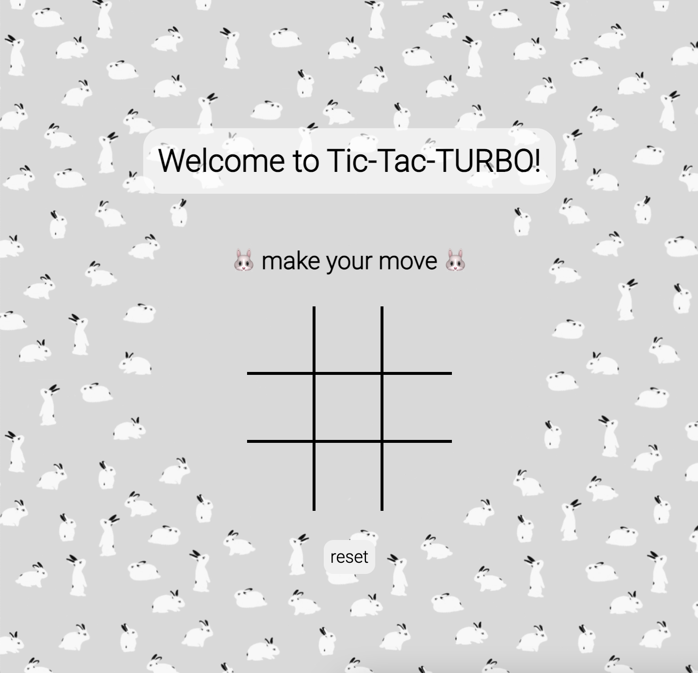
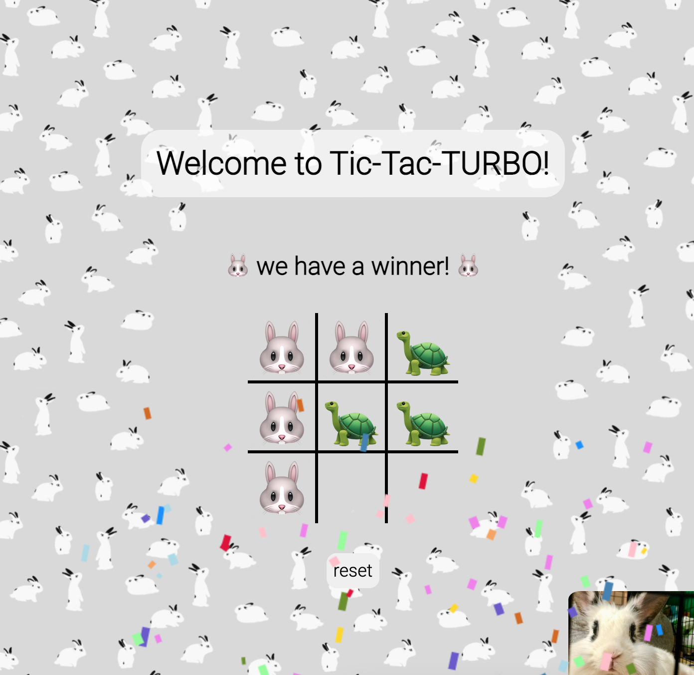
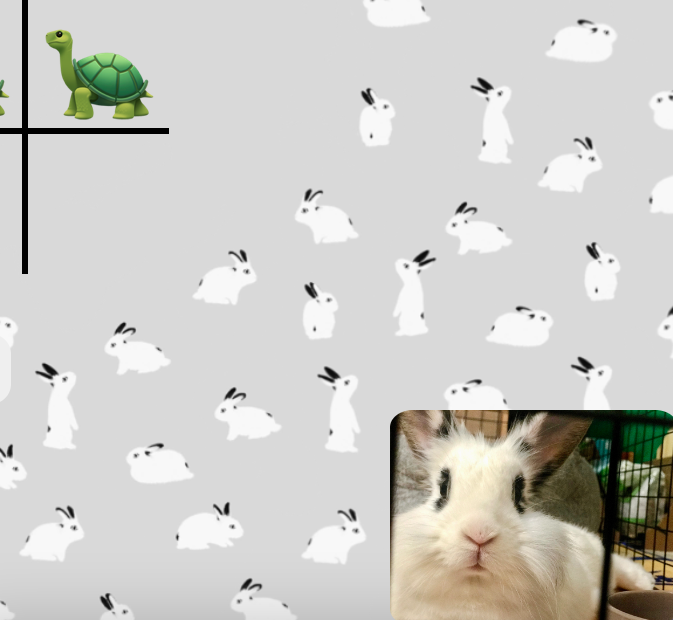

# 🐰 Tic-Tac-Turbo 🐢

## 👇🏼 CLICK BELOW TO PLAY 👇🏼
Link to play the game: https://tic-tac-turbo.fly.dev/

## Background & Description
Welcome to Tic-Tac-**TURBO**! 
This was the first browser game I built during my time in the Software Engineering Immersive Program at General Assembly. 

The theme for Tic-Tac-Turbo was inspired by my pet rabbit, Turbo, who makes an appearance when Player 1 wins. I wanted to add a personal touch to the game, which made it even more enjoyable to build!

## Screenshots of the App 📸

## Technology Implemented
- CSS
- DOM Manipulation
- Git/GitHub
- HTML
- JavaScript
- Procreate

## Credits
- [Animate.css](https://animate.style/)
- [Bootstrap](https://getbootstrap.com/)
- [ClipartMax](https://www.clipartmax.com/)
- [Confetti.js](https://github.com/SEI-Remote/confetti)
- [Emojipedia](https://emojipedia.org/)
- [Google Fonts](https://fonts.google.com/)
- [SEI-Remote Tic-Tac-Toe Starter Code](https://github.com/SEI-Remote/ttt-weekend)

## Icebox Items 🧊
- [ ] Add an image of a turtle when Player 2 wins
- [ ] Include animation of images so that they appear and disappear within a few seconds
- [x] Add a rabbit favicon

## Shoutout to Classmates!
- Damian Bzdyra
- David Vazquez
- Jess Landis
- Nate Morgan